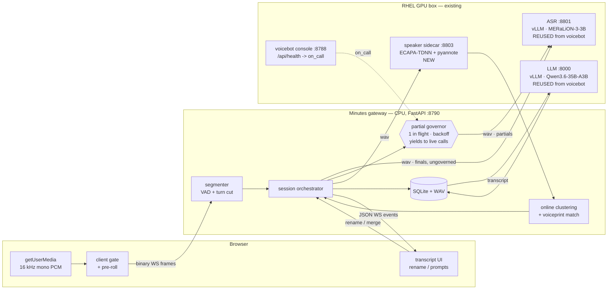

# Voice Meeting Minutes — solution design (draft)

A browser app that records a meeting live, transcribes it in real time, works out who is
speaking, asks the user to name the speakers it does not recognise, and produces meeting
minutes when the meeting ends.

Inference runs on the RHEL GPU box that already hosts the
[`voicebot`](https://github.com/wyichew2708/voicebot) services. **The ASR is not a new
deployment** — it is the MERaLiON-on-vLLM endpoint that voicebot already talks to, reused
as-is. The same applies to the LLM used for minutes.

Status: **draft for review.** Nothing here is built yet. Sections marked ⚠ are the ones
worth arguing about before code is written.

---

## 1. What the user sees

One page, three states.

```
┌──────────────────────────────────────────────────────────────────────┐
│  Weekly underwriting sync                            00:14:22   ● REC│
│  ┌────────────┐ ┌────────────┐ ┌────────────┐                        │
│  │  ▶ Start   │ │  ⏸ Pause   │ │  ■ End     │                        │
│  └────────────┘ └────────────┘ └────────────┘                        │
├───────────────────────────────────────────┬──────────────────────────┤
│ TRANSCRIPT                                │ SPEAKERS                 │
│                                           │                          │
│ ● Jimmy Chew            00:13:41          │ ● Jimmy Chew        4:12 │
│   Let's start with the claims backlog.    │ ● Speaker 2         2:38 │
│                                           │ ● Speaker 3         0:51 │
│ ● Speaker 2             00:13:49          │                          │
│   We cleared about sixty percent of it.   │ ┌──────────────────────┐ │
│                                           │ │ Who is Speaker 2?    │ │
│ ● Speaker 3             00:13:58          │ │ heard 2m 38s  ▶ play │ │
│   ...and the rest is waiting on medical   │ │ [            ] [Save]│ │
│   reports  ▏                              │ │ Maybe: Aisha · Wei   │ │
│                                           │ └──────────────────────┘ │
└───────────────────────────────────────────┴──────────────────────────┘
```

- **Start / Pause / End.** Pause stops sending audio and freezes the clock; the meeting and
  its speaker roster survive. End closes the recording and kicks off minutes generation.
- **Live transcript**, Zoom/Teams style: the in-progress line is grey and italic and rewrites
  itself as more audio arrives; when the speaker stops it settles into a solid final line.
- **Double-click a speaker label** — in the transcript or in the sidebar — to rename it.
  The rename applies to every line that speaker has already said and every line they say
  next, because the label is a pointer to a cluster, not a string stored per line.
- **Auto-prompt.** When the system has heard enough of an unnamed voice to be confident it is
  a distinct person, a card appears in the sidebar asking who it is, with a play button for a
  representative clip and up to three suggestions from the voiceprint library. It is
  non-blocking: ignore it and the transcript keeps running with `Speaker 2`.
- **After End**, the page switches to the review view: full transcript (editable), generated
  minutes (editable), export buttons.

⚠ **Consent.** The page must show a visible recording indicator and capture an explicit
"everyone here consents to being recorded and voice-matched" acknowledgement before the first
Start. Voiceprints are biometric data — see §9.

---

## 2. Architecture



The gateway is deliberately thin and stateless-per-process-restart-tolerant: it holds no
models, so it restarts in a second and can be redeployed without touching the GPU services.
This is the same split voicebot already uses (`src/voicebot/runtime/cuda_backend.py` loads
nothing in-process), and it is why the ASR can be shared between the two products without
either one being able to take the other down.

### Why the segmentation moved to the server

voicebot does endpointing **in the browser**: the client's VAD decides an utterance ended and
sends `{"type":"utterance_end"}`, and the server transcribes whatever it has buffered
(`ui/demo-console.html:1844`, `src/voicebot/server.py:596`). That is right for a two-party
phone call where a turn is a turn.

A meeting is not that. Turns overlap, people interject, and the cut points that matter are
*speaker changes*, which the browser cannot see. So:

- the browser keeps a **cheap** gate — enough to avoid streaming an empty room over the
  network, plus the 320 ms run-up buffer so word onsets are not clipped;
- the **gateway** owns real segmentation: it runs its own VAD over the continuous stream and
  cuts a segment on 600 ms of silence, on a 12 s hard cap, or on an embedding divergence that
  says the voice changed mid-run.

---

## 3. Reusing the voicebot STT API

The endpoint, exactly as voicebot calls it (`config/rhel.yaml`, `cuda_backend.py:74-104`):

```
POST http://127.0.0.1:8801/v1/audio/transcriptions      # OpenAI-compatible, served by vLLM
Content-Type: multipart/form-data
  model = MERaLiON/MERaLiON-3-3B-ASR
  file  = audio.wav        16 kHz, mono, 16-bit LE PCM in a WAV container

200 -> {"text": "we cleared about sixty percent of it"}
```

No change to that service is required, and no second copy of the model is loaded. The new app
points `MINUTES_ASR_URL` at the same address.

### 3.1 What is lifted from voicebot, and how

| Piece | voicebot source | Reuse |
|---|---|---|
| ASR HTTP client (hand-rolled multipart, thread pool off the event loop) | `runtime/cuda_backend.py:74-104` | **verbatim**, minus the `Backend` protocol |
| WAV framing for the request body | `runtime/cuda_backend.py:64-71` | verbatim |
| Silence trim before ASR | `pcm.trim` | verbatim |
| Pre-ASR noise gate (`is_speech`) and post-ASR hallucination gate (`is_plausible`) | `audio_gate.py` | **verbatim, and load-bearing** — see below |
| Browser mic capture: downsample-by-averaging, `pcm16`, adaptive noise floor, run-up ring buffer | `ui/demo-console.html:1705-1890` | adapt: keep capture + floor tracking, drop the barge-in and per-turn endpointing |
| Env-override config loader (`VOICEBOT_ASR_URL` pattern) | `config.py` | adapt naming to `MINUTES_*` |
| Language detection from transcript text | `lang.py` | verbatim |
| Per-session JSONL event recorder | `recording.py`, `events.py` | adapt — meetings persist to SQLite, but the JSONL audit trail is worth keeping |
| `on_call` yield signal, and the reasoning behind it | `server.py:145`, `server.py:320-328` | **consumed as an API** — the gateway polls it to suspend partials while a call is live (§3.3) |

**The audio gates are not optional.** voicebot's own notes are blunt about why: fed silence or
room noise, Whisper-family models return fluent invented sentences rather than nothing, and
everything downstream believes them (`audio_gate.py:1-11`). In a call that produces one wrong
turn. In a 60-minute meeting transcript it produces dozens of confident fabrications that then
get summarised into minutes as if someone had said them. Both gates run on every segment.

### 3.2 ⚠ Two real gaps in the reused ASR

1. **No word- or segment-level timestamps.** The endpoint returns text only. All timing in
   this product therefore comes from *our* VAD boundaries — accurate to the segment (±100 ms),
   not to the word. Good enough for minutes, speaker attribution and a clickable transcript;
   **not** good enough for karaoke-style word highlighting. If word timing is wanted later, run
   a forced aligner (WhisperX / MFA) over the recording during the post-processing pass — it is
   CPU work on a finished file, so it costs the shared GPU nothing.

2. **Utterance-scoped, not streaming.** vLLM's transcription endpoint takes a whole clip and
   returns whole text. To get the Zoom-like interim line we re-send the *open* segment's audio
   every ~1.5 s and replace the partial. Since that goes to the same shared endpoint (§3.3),
   the governor below is what keeps it from costing anyone else anything.

### 3.3 Sharing one ASR endpoint with live voicebot calls

**Decided: one endpoint, no second replica.** Both partials and finals go to the MERaLiON
instance voicebot already hosts on `:8801`. That keeps VRAM allocation untouched and means
there is exactly one ASR to operate, patch and monitor.

The cost of that decision has to be paid somewhere, and the place it would otherwise land is a
live voicebot call. That box has already demonstrated the failure precisely: voicebot's own
pre-render warm-up notes that *"a turn that reads from a warm cache in 5 ms took 13.6 seconds
with a warm-up running behind it"* (`server.py:320-328`). GPU contention on this machine is not
theoretical, and a minutes app quietly generating partials is exactly the shape of background
job that caused it.

So partial transcription runs under a **governor**, and every rule in it exists to protect
somebody else's latency:

1. **One partial in flight per meeting, never queued.** If the previous partial has not
   returned when the next 1.5 s tick arrives, the tick is skipped. This bounds partial
   concurrency to the number of people currently mid-sentence, not to the tick rate.
2. **Partials use a short timeout and are dropped, not retried.** 1.2 s against the finals'
   30 s. A partial that is late is worthless — the audio it describes has already been
   superseded — so abandoning it is free, and it stops a busy queue from getting busier.
3. **Finals are never governed.** They are the product; they get the full timeout, unbounded
   retries and priority in the gateway's own dispatch. A meeting always ends with a complete
   transcript even if not one partial ever rendered.
4. **Yield while a voicebot call is live.** voicebot's health endpoint already publishes
   `on_call` for exactly this purpose — its own comment says it is there *"so a warm-up running
   outside this process can stand aside too"* (`server.py:145`). The gateway polls
   `http://127.0.0.1:8788/api/health` every 5 s and suspends partials while `on_call` is true.
   Finals continue: they are one short request per utterance and are the same order of load as
   the call itself.
5. **Adaptive backoff.** The gateway tracks its own ASR round-trip time. Above a 900 ms p50 the
   partial interval doubles (1.5 s → 3 s → 6 s → off); below it, the interval walks back down.
   Under sustained load the app degrades to finals-only *by itself*, without an operator, and
   recovers the same way.

**Growing-window cost, and the cap on it.** A partial re-transcribes the open segment from its
start, so one 12 s segment refreshed every 1.5 s submits 1.5 + 3 + … + 12 ≈ 54 s of audio
against the final's 12 s — 4.5×, and that ratio, not the request count, is the real GPU cost.
The interval therefore **widens as the segment grows**: 1.5 s for the first 6 s, then 3 s —
ticks at 1.5, 3, 4.5, 6, 9 and 12 s, so 36 s of audio instead of 54 s, a third off for no
perceptible change. The liveness that matters is at the *start* of a sentence, which is where
the eye is watching and where the fast cadence is kept.

**What the user sees when the governor bites.** The interim line stops updating and the header
shows a quiet "live text paused — lines still arriving" note. Final lines keep landing ~1.2 s
after each person stops talking, which is what makes the transcript feel live in the first
place. Nothing is lost, and nothing needs to be re-recorded.

⚠ This is the one part of the design that must be **load-tested before it goes near a
production voicebot call**: run a 4-person meeting with partials on while a call is in
progress, and measure the call's turn latency, not the meeting's. If the governor is not
enough, the next lever is partials off by default rather than a second replica.

---

## 4. Speaker recognition

Three layers, each fixing what the one before it gets wrong.

### 4.1 Online: embed and cluster, live

Every closed segment goes to the speaker sidecar and comes back as a 192-dim embedding.

- **Model:** `speechbrain/spkrec-ecapa-voxceleb` (ECAPA-TDNN, 192-dim). ~20 ms per segment on
  the GPU, ~80 MB of VRAM. NVIDIA TitaNet-L via NeMo is the alternative if NeMo is already on
  the box; ECAPA wins on setup cost.
- **Assignment:** cosine-similarity to existing cluster centroids in the session.
  - `≥ 0.70` → that cluster.
  - otherwise → check the **voiceprint library** (§4.3) at a stricter `≥ 0.75`; a hit creates
    a cluster that is *already named*.
  - otherwise → a new cluster, labelled `Speaker N`.
- **Centroid update:** duration-weighted running mean. Segments **shorter than 1.5 s are
  assigned but never update a centroid** — short-clip embeddings are noisy and a run of them
  drags a centroid onto the wrong person, after which every subsequent segment is misfiled.
- **Turn-change cut:** while a segment is open past ~4 s, embed the trailing 1.5 s window and
  compare to the segment's own leading window. Divergence below 0.6 cuts the segment there,
  so an uninterrupted exchange does not become one block attributed to whoever spoke first.

⚠ **0.70 / 0.75 / 0.6 are starting points from VoxCeleb-scale conventions, not measurements.**
They must be tuned on real recordings of the actual meeting room and the actual mic — the
voicebot README is emphatic about exactly this failure mode for ASR, and it applies here.
Getting them wrong is visible: too low merges two people into one label, too high splits one
person into `Speaker 2` and `Speaker 5`.

### 4.2 Offline: refine when the meeting ends

Online clustering is causal — it makes early decisions with almost no evidence and cannot take
them back. So on End, the full recording is re-diarized properly with
`pyannote/speaker-diarization-3.1`, which does segmentation, overlap-aware embedding and global
clustering over the whole meeting at once.

The refined diarization is mapped back onto the session's clusters **by maximal temporal
overlap, not by embedding similarity** — pyannote uses its own WeSpeaker embedding space, and
cosine distances between the two spaces are meaningless. Any names the user already assigned
travel with the cluster.

Result: labels near the start of the meeting get corrected, and the transcript the minutes are
generated from is the refined one. Cost: roughly 0.05–0.1× realtime on the GPU, so a 60-minute
meeting refines in 3–6 minutes — which is why minutes generation waits for it and the End
screen shows progress rather than blocking.

⚠ pyannote 3.1 is a gated model: it needs a Hugging Face token and acceptance of the model
terms on the hub. Confirm that is acceptable on an air-gapped or policy-restricted host, or
plan to vendor the weights.

### 4.3 Across meetings: the voiceprint library

When a user names a cluster and ticks *remember this voice*, the cluster centroid is stored:

```json
{ "id": "spk_7f3a", "name": "Jimmy Chew", "embedding": [192 floats],
  "samples": 14, "seconds": 512.3, "meetings": 6, "updated": "2026-09-08T02:11:00Z" }
```

Next meeting, that voice is recognised on its first segment and never has to be named again —
this is the "recognising speakers identity" half of the requirement, and it is the part that
makes the app feel like it knows the team. Centroids keep improving as the same person appears
in more meetings.

Enrolment is **opt-in per speaker**, and every voiceprint is individually deletable (§9).

### 4.4 The auto-prompt

A cluster is prompted for when **all** of:

- it has no name, and
- it has ≥ 6 s of cumulative speech, and
- it has ≥ 2 separate segments (one long monologue is not evidence of a stable centroid), and
- it has not already been dismissed twice.

The prompt carries the cluster's loudest clean 3 s as a playable clip, and the top three
library matches scoring ≥ 0.55 as one-tap suggestions. Dismiss once → re-offered after another
30 s of speech. Dismiss twice → silent for the rest of the meeting, still renameable by
double-click.

### 4.5 Rename, merge, split

- **Rename** sets `cluster.name`; every segment referencing that cluster re-renders. Nothing
  is rewritten in storage — segments store `cluster_id`, never a name.
- **Merge** happens implicitly when the user gives two clusters the same name: the app asks
  "merge Speaker 2 into Jimmy Chew?" and, on yes, re-points the segments and merges centroids
  duration-weighted. This is the fix for over-splitting, and it is common enough that it must
  be one click.
- **Split** is the harder inverse (one cluster that is really two people) and is **out of scope
  for v1**; the offline refine pass is the answer to most of it. Manual per-segment reassignment
  from a dropdown covers the rest.

---

## 5. Segmentation and the live loop

```
mic ──► client gate ──► WS binary ──► ring buffer ──► server VAD
                                                          │
                              ┌───────────────────────────┴──────────────┐
                       segment closes on:                          still open:
                       · 600 ms silence                             every 1.5 s
                       · 12 s hard cap (cut at quietest frame)      └─► partial ASR
                       · embedding divergence                            └─► "partial" event
                              │
                    ┌─────────┴─────────┐
              ASR (final)          embedding
                    └─────────┬─────────┘
                         join on segment_id
                              │
                    is_plausible() gate ──drop──► (logged, not shown)
                              │
                     cluster assign ──► persist ──► "segment" event
```

**Latency budget for a final line** (short utterance, warm services):

| Stage | Budget |
|---|---|
| endpoint wait (600 ms silence) | 600 ms |
| WAV framing + HTTP | ~15 ms |
| MERaLiON on vLLM | ~600 ms (voicebot's measured figure on this box) |
| ECAPA embedding (parallel with ASR) | ~20 ms |
| clustering + persist | < 5 ms |
| WS to browser + render | ~15 ms |
| **total after the speaker stops** | **≈ 1.2 s** |

The 12 s hard cap matters: a monologue must not sit unsent for a minute. When it fires, the cut
lands on the lowest-energy frame in the trailing second so a word is not sliced in half, and
the next segment carries 200 ms of overlap so the recogniser has context.

---

## 6. Minutes generation

Reuses the same vLLM chat endpoint voicebot uses for its guardrail
(`POST /v1/chat/completions`, Qwen3.6-35B-A3B on `:8000`), with a much larger `max_tokens` —
voicebot caps at 220 because it is classifying a single reply; minutes need ~2000.

Map-reduce, because a 60-minute meeting does not fit a single sensible prompt:

1. **Map.** Chunk the speaker-attributed transcript into ~4000-token windows with 200-token
   overlap. Each chunk → JSON: `{topics[], decisions[], actions[], questions[], quotes[]}`.
2. **Reduce.** Feed the chunk JSONs (not the raw transcript) into one final call that
   deduplicates, orders and produces the meeting document.
3. **Resolve.** Action-item owners are matched against the session's named speakers, so
   "Jimmy will chase the medical reports" becomes `{owner: "Jimmy Chew", ...}` rather than a
   loose string. Unmatched owners are left as free text and flagged in the UI.

Output schema:

```json
{
  "title": "Weekly underwriting sync",
  "date": "2026-09-08", "duration_seconds": 3241,
  "attendees": [{"name": "Jimmy Chew", "speaking_seconds": 812}],
  "summary": "…3-5 sentences…",
  "topics":    [{"heading": "Claims backlog", "points": ["…"], "t0": 41.2}],
  "decisions": [{"text": "…", "t0": 508.9, "speaker": "Jimmy Chew"}],
  "actions":   [{"text": "…", "owner": "Aisha", "due": "2026-09-15", "t0": 612.0}],
  "open_questions": ["…"],
  "risks": ["…"]
}
```

Rendered to Markdown for the UI, and exported as Markdown / DOCX / PDF. Every decision and
action carries `t0`, so each line in the minutes is a **click back to that moment in the
transcript and the audio** — the single feature that makes generated minutes trustworthy,
because a reader can check them.

⚠ Same warning voicebot puts on its own LLM config: this job is a long, bursty generation.
Point it at the reserved replica or a priority-scheduled queue, or a batch minutes run will
land on top of a live voicebot call and turn it into dead air.

⚠ **Hallucinated action items are the real risk here**, more than transcription errors. The
prompt is constrained to extract only spans present in the transcript, every item carries its
`t0` for verification, and the minutes are presented as an **editable draft** — never as a
finished record. Nothing is auto-sent anywhere.

---

## 7. Repository layout

```
voice-meeting-minutes/
├── src/minutes/
│   ├── server.py            FastAPI: REST + /ws        (shape follows voicebot/server.py)
│   ├── config.py            YAML profiles + MINUTES_* env overrides
│   ├── session.py           MeetingSession: buffers, segmenter, dispatch
│   ├── segmenter.py         server-side VAD, turn cuts, hard cap
│   ├── audio_gate.py        lifted from voicebot
│   ├── pcm.py               lifted from voicebot
│   ├── clients/
│   │   ├── asr.py           the voicebot multipart client, reused
│   │   ├── speaker.py       → speaker sidecar :8803
│   │   └── llm.py           → vLLM chat :8000
│   ├── speakers/
│   │   ├── cluster.py       online clustering, centroids, merge
│   │   ├── library.py       voiceprint store + matching
│   │   └── refine.py        offline pyannote pass + overlap mapping
│   ├── minutes/
│   │   ├── prompts.py       map + reduce prompts
│   │   └── render.py        JSON → Markdown / DOCX
│   └── store.py             SQLite schema + audio files
├── services/speaker_sidecar.py    ECAPA + pyannote behind FastAPI :8803
├── ui/index.html            single-page console (voicebot's console as the starting point)
├── config/{rhel,local,mock}.yaml
├── deploy/                  compose + podman scripts, mirroring voicebot/deploy
├── docs/
│   ├── solution-design.md   this file
│   └── api-contract.md      WS protocol, REST, data model
└── tests/
```

`mock` profile: canned ASR text and synthetic embeddings, no GPU. voicebot's mock backend is
what makes its tests runnable anywhere, and the same trick is what will let this app's
segmenter, clustering, rename and merge logic be tested in CI without a GPU. Build it first,
not last.

---

## 8. Deployment

Onto the existing RHEL box, alongside voicebot, nothing displaced:

| Service | Port | Status | VRAM |
|---|---|---|---|
| ASR — vLLM, MERaLiON-3-3B | 8801 | **existing, shared** — carries finals *and* partials (§3.3) | ~0.22 util (already allocated) |
| LLM — vLLM, Qwen3.6-35B-A3B | 8000 | **existing, shared** | already allocated |
| voicebot console — read for `on_call` | 8788 | **existing**, read-only | none |
| Speaker sidecar — ECAPA + pyannote | 8803 | **new** | ~1.5 GB |
| Minutes gateway — FastAPI | 8790 | **new** | none (CPU) |

Total new VRAM: **~1.5 GB**, all of it the speaker sidecar. No new ASR, no new LLM, and no
change to voicebot's existing allocation.

All GPU services stay bound to `127.0.0.1` exactly as voicebot binds them
(`deploy/rhel/services.sh`); the gateway is the only port that leaves the host, behind TLS and
authentication. Containers via podman with `--device nvidia.com/gpu=all` and the `:Z` SELinux
relabel, following voicebot's script so both products are operated the same way.

Browser needs `getUserMedia`, which requires a **secure context** — TLS in front of the gateway
is a hard requirement, not a nicety, or the mic silently never starts.

---

## 9. Privacy, consent, retention

Not a footnote — this app records people and builds biometric identifiers of their voices.

- **Consent.** An explicit acknowledgement before the first recording, and a persistent visible
  recording indicator while it runs. Under Singapore's PDPA, voiceprints are personal data and
  the purpose (identifying speakers in minutes) must be stated and consented to.
- **Voiceprints are opt-in per speaker**, individually listable and individually deletable.
  Deleting a voiceprint deletes the embedding and unlinks the name — the same "the clip is a
  file, the entry is a line of JSON, and deleting the voice deletes both" reversibility
  voicebot applies to its cloned voices.
- **Retention.** Audio, transcript and minutes each get a configurable TTL, defaulting to
  audio 30 days / transcript 1 year / minutes indefinite. Audio is the sensitive artefact and
  should have the shortest life.
- **Access.** Meetings are private to their creator plus explicitly invited viewers. No
  cross-tenant listing.
- **Data stays on the box.** No third-party API is involved in any path.
- **Redaction.** A per-meeting "do not retain audio" mode that deletes the WAV once minutes are
  generated, keeping only the text.

---

## 10. Risks

| Risk | Impact | Mitigation |
|---|---|---|
| **Overlapping speech** — two people talking at once | Single-channel diarization degrades badly; both get attributed to one label or to neither | pyannote 3.1's overlap-aware pass in the refine step; encourage per-participant mics for remote joins; be honest in the UI that overlaps are approximate |
| **Far-field room mic** | voicebot's gate thresholds were tuned for a headset on a phone call; a table mic in a boardroom has a different noise floor and 3–5× the reverberation | Re-tune the floor tracker on real room audio; consider Silero VAD instead of the energy gate; make sensitivity a per-room setting |
| **ASR fabrication over silence** | Fluent invented sentences enter the minutes as things people said | Both voicebot gates, unmodified, on every segment (§3.1) |
| **Cluster over-split / under-merge** | Transcript reads as 9 speakers in a 4-person meeting | Offline refine; one-click merge; tuned thresholds; short-segment centroid guard |
| **Partial-transcript GPU load** | Competes with live voicebot calls on the same recogniser — the box has already produced a 5 ms → 13.6 s turn under exactly this contention | The §3.3 governor: one partial in flight, dropped not queued, adaptive backoff, and suspension while `on_call` is true. **Load-test it against a real call before production** |
| **Hallucinated action items** | Someone is assigned work they never agreed to | Constrained extraction, `t0` on every item, editable draft, nothing auto-sent |
| **Accuracy unmeasured** | All model choices here are from published characteristics, not from measurements on this room and these speakers | Benchmark on real recordings before any accuracy claim — voicebot's README makes precisely this mistake visible and refuses to repeat it |
| **Long meetings** | 2-hour meeting = ~1400 segments, refine pass minutes long, transcript large | Streaming persistence per segment; refine progress in the UI; map-reduce minutes already handles length |

---

## 11. Delivery plan

| Phase | Scope | Est. |
|---|---|---|
| **P0 — record & transcribe** | WS transport, client capture (lifted), server segmenter, ASR client (lifted), both gates, the §3.3 partial governor and its load test, Start/Pause/End, live transcript, SQLite, mock profile + tests | ~1 week |
| **P1 — speakers** | Speaker sidecar, ECAPA embeddings, online clustering, coloured labels, double-click rename, merge | ~1.5 weeks |
| **P2 — identity** | Voiceprint library, cross-meeting recognition, auto-prompt card with clip + suggestions, opt-in enrolment | ~1 week |
| **P3 — minutes** | Map-reduce generation, JSON schema, Markdown/DOCX export, click-through from minutes to transcript to audio | ~1 week |
| **P4 — hardening** | Offline pyannote refine, consent flow, retention/deletion, auth, TLS, deploy scripts, threshold tuning on real recordings | ~1 week |

P0 is independently useful: a recorder that produces a searchable transcript, with speakers
added later without a rewrite, because segments point at cluster IDs from day one.

---

## 12. Decisions needed before implementation

1. ~~**Interim transcripts** — second small ASR replica, or finals-only?~~ **Decided:**
   reuse the single ASR endpoint voicebot already hosts, for both partials and finals, under
   the governor in §3.3. No second replica. Remaining work is the load test named there.
2. **pyannote gating** — is a Hugging Face token and accepted model terms acceptable on that
   host, or do the weights need vendoring? (§4.2)
3. **Languages** — English only, or the same `[en, zh]` set voicebot serves, plus Singlish?
   MERaLiON handles all of them; it affects prompt design and the minutes language.
4. **Multi-tenant or single-team?** Decides SQLite vs Postgres and how much auth is needed.
5. **Meeting-room hardware** — one table mic, or per-participant devices joining the same
   meeting? Per-participant is a substantially easier diarization problem and a
   substantially better product; worth knowing before P1.
6. **Retention defaults** — the 30 day / 1 year / indefinite proposal in §9 needs a compliance
   sign-off, not an engineering one.
